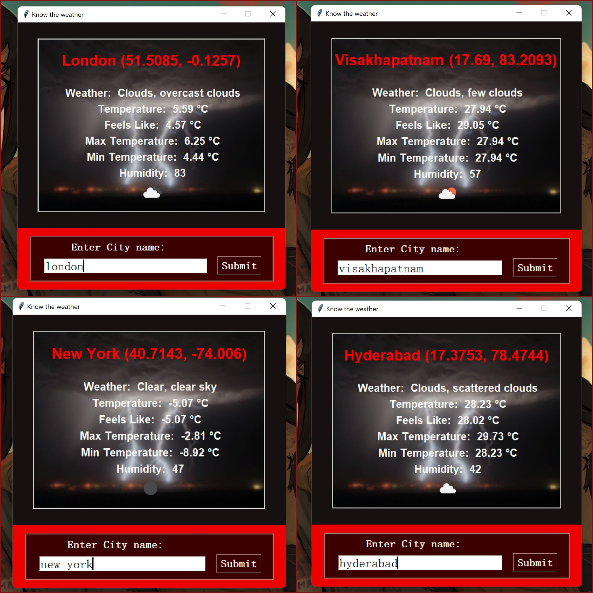

<p align="center"></p>
<h1 align="center">Weather-API-GUI-Tkinter☁️❄️</h1>
<h2 align="center">version-1️⃣.0️⃣.0️⃣</h2>
 
 This repo contains a weather forecasting tool made using tkinter which works by fetching query made city's weather using an API.
 # so what is an API?
 - API is the acronym for Application Programming Interface, which is a software intermediary that allows two applications to talk to each other. Each time you use an app like Facebook, send an instant message, or check the weather on your phone, you’re using an API.
 - When you use an application on your mobile phone, the application connects to the Internet and sends data to a server. The server then retrieves that data, interprets it, performs the necessary actions and sends it back to your phone. The application then interprets that data and presents you with the information you wanted in a readable way. This is what an API is - all of this happens via API.
 - Coming to our weather api project, Weather APIs are Application Programming Interfaces that provide access to current & historical weather data on a global scale. There are several public weather APIs like OpenWeatherMap API, Dark Sky API, & Visual Crossing Weather API. 
### Here is a illustration of api:


## Top 10 Weather api are as follows: 
- OpenWeatherMap API
- Dark Sky API
- Weather API
- Simple Weather API
- Weather2020 API
- Air Quality API
- Weather by Location API
- Visual Crossing Weather API
- AccuWeather API
- AerisWeather API


In this project an APi of <a href='https://openweathermap.org/api'> OpenWeather </a> is used to request weather of a city by sending a query to the api.\
query looks like this: 

```bash
url :  http://api.openweathermap.org/data/2.5/weather
{"q":cityy_name.get(),'units':'metric','appid':api_key }
```
in the url the city name along with my api id and unit system are comined and sent as an https request using the request modules's request() method,
the output is in the format of json file.

the response from the api looks something like this:
```
{'coord': {'lon': -71.06, 'lat': 42.36}, 'weather': [{'id': 500, 'main': 'Rain', 'description': 'light rain', 'icon': '10d'}], 'base': 'stations', 
    'main': {'temp': 298.88, 'feels_like': 302.56, 'temp_min': 298.15, 'temp_max': 299.82, 'pressure': 1010, 'humidity': 85}, 'visibility': 10000, 
    'wind': {'speed': 2.24, 'deg': 151, 'gust': 4.47}, 'rain': {'1h': 0.25}, 'clouds': {'all': 82}, 'dt': 1596407271, 'sys': {'type': 3, 'id': 2005683, 
    'country': 'US', 'sunrise': 1596361095, 'sunset': 1596412955}, 'timezone': -14400, 'id': 4930956, 'name': 'Boston', 'cod': 200} 

```
which is then this data is formatted into the gui application by using appropiate dictionary methods.

# The GUI application looks like this: 
<p align="center"></p>
<p align="center">(the GUi is made using frames,canvas,entry methods in tkinter)</p>
<p align="center">(colors are choosen from <a href='https://colorhunt.co/'>colorhunt</a> )</p>

- Any city around the globe can be sent as query and it's current weather condition data can be retrieved and displayed.

## imports used in this project are
```python
from tkinter import *
import tkinter,requests
from tkinter.font import BOLD
from urllib import response
from tkinter import BOTH
from PIL import ImageTk, Image
from io import BytesIO
from cv2 import FONT_HERSHEY_COMPLEX
```

Not just the weather data, even the icon of the weather condition can be retrieved from openweather api, its free to use and faster compared to other api's.

## Note:
- System must be connected to the internet for the app to work.
- No spelling mistakes must be made while sening query. 
- Enter city name (not country,continent name)  then hit submit.

#### The main intention behind this project is to learn how to work with api's, gathering/retrieving information from web , formatting and producing it in a GUi application which looks good, minimal and easy to use. Feel free to fork the repo and imporve it by changing ui,colors or add more functionality. You can find detailed code xplanation for every line in comments in <a href='https://github.com/sasivatsal7122/Weather-API-GUI-Tkinter/blob/main/weather_api.py'>source</a>, I will also be posting line to line instructions along with xplanation how to build this application along with other very basic GUi applications in <a href='https://github.com/sasivatsal7122/learn-tkinter-with-me'>learn-tkinter-with-me</a> repo, do check that and it's been a lot of hardwork, struggle making this app work as intended at the same time look good, a lot of trial and error has been made for the colors to make ui look good so leave a star if u like this project.
